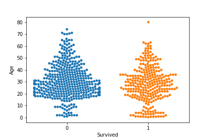

# Jeff_Portfolio
Datascience Portfolio

# [Project 1: Building Fitness Profiles for Customers](https://github.com/jeffbarrecchia/Fitness_Profile_Project)
(click above for Fitness repo)

This project was done with a dataset pulled off of Kaggle. It features several different graphs and modeling as well as a couple simple linear regression examples to predict how many miles a customer will plan on riding per week. These are based off of several factors: income, gender, age, and current fitness level the customer says they are at.

# [Project 2: Predicting Survivors Aboard the Titanic](https://github.com/jeffbarrecchia/Titanic_Prediction)
(click above for Titanic repo)

In this project, the idea was to construct a predictive model through classification to decide who will or will not die aboard the Titanic. Used in this project was CatBoostClassifier. I also made several informative displays regarding different variable and how they relate to survival aboard the Titanic, including a heatmap covering the correlation of all variables.

